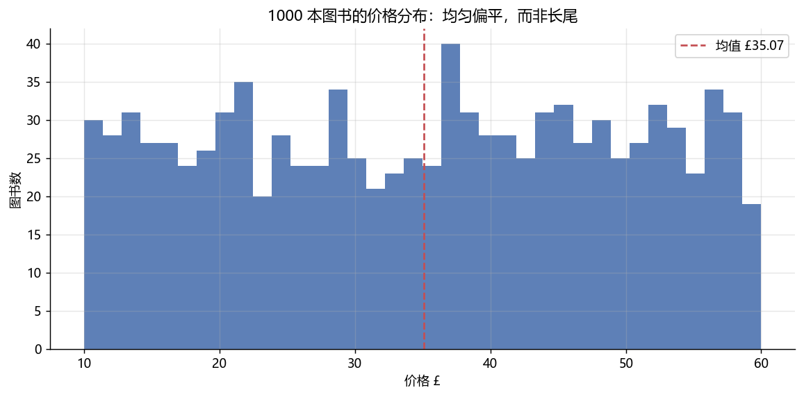

# HTML 爬虫：1000 本图书的结构化采集与"无聊数据"分析

作品集里此前全是 API 采集——这个项目补上**网页解析**这一环：
BeautifulSoup + CSS 选择器，采集 toscrape.com（专为爬虫练习搭建的沙盒站，
robots 与条款均允许抓取）的全部 1000 本图书。

## 采集

- 目标：目录页 50 页 × 每页 20 本；字段：书名 / 价格(£) / 星级评分 / 库存；
- 解析：CSS 选择器 `article.product_pod` → `h3 a[title]`、`p.price_color`、
  `p.star-rating`（评分藏在 class 名里：`star-rating Four` → 4）；
- 协议：1 秒限速 + 磁盘缓存 + 429 退避（复用共享 Fetcher）；
- 去重后 999 本（站点存在 1 个重复条目）。

## 分析结论

1. 价格 £10.00 ~ £59.99，均值 £35.07，分布**近似均匀**——这是沙盒数据的
   刻意设计，不是真实书价的长尾形态（如实标注，不装作发现了规律）；
2. 评分五档几乎均匀（各 18%~23%），评分与价格 Pearson 相关 **0.03**：
   分组均价几乎持平——又一个"看起来该有关系、实际没有"的例子；
3. 100% 图书有货（沙盒设定）。



## 项目结构

```
08_book_scraper/
├── collect.py     # 采集：requests + BeautifulSoup，分页循环
├── analyze.py     # 分析：价格/评分/结构，出 2 图
└── data/books_raw.csv
```

## 复现

```bash
python collect.py    # 50 个请求，约 1 分钟（限速），缓存后秒级
python analyze.py
```
